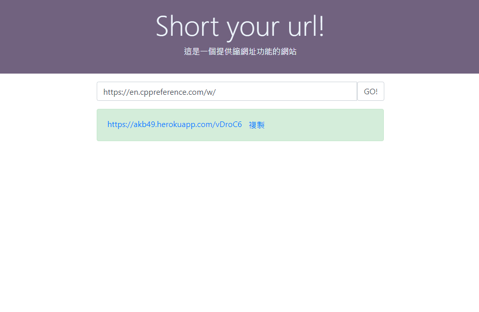

# Shorturl App
> Tool keywords: Docker, Mysql(v.1.0.0), Fastapi, Aiosqlite
## Overview
The application is used to shorten long url, and the short url is valid until the application is down or 6-digit codes generated for short url is almost exhausted (how can that be?) .
## Requirement
- Program: [Docker](https://www.docker.com/)
- Environment: Unix/Linux
## Getting started
```bash
# download the code
$ git clone https://github.com/Zhima-Mochi/shorturl-app.git
$ cd shorturl-app
# build and run the application
$ docker-compose up
```
Now, have fun with http://localhost.
## Demo
<<<<<<< HEAD
[Heroku app website](https://akb49.herokuapp.com/) (see branch heroku-demo)


=======
- [Heroku app website](https://akb49.herokuapp.com/) (slow start) (see branch heroku-demo)


>>>>>>> 4b636760a64ef9c4174e429a865a2988831b029c


## Note
All the url will be tested first it can be requested or not, so there is CORS block issue.
